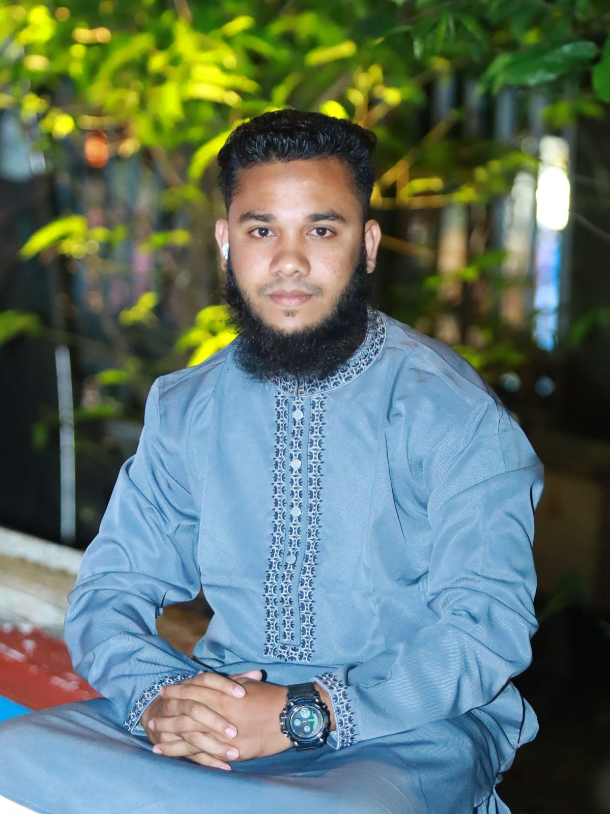

<!-- ======================= HEADER ======================= -->

<div align="center">



# 👋 Hi, I'm **Md Asraful Islam**

### 💻 CSE Student | Web Developer | Aspiring Full-Stack Developer

<p>
  <a href="https://github.com/Asraful666">
    
  </a>
  <a href="https://github.com/Asraful666?tab=repositories">
    
  </a>
  <a href="https://github.com/Asraful666">
    
  </a>
</p>

</div>

---

## 🧑‍💻 About Me

Hi! I'm **Asraful Islam**, a Computer Science & Engineering student at **Sylhet International University** from Bangladesh 🇧🇩.

I'm passionate about **Web Development** and currently working on improving my frontend skills while moving toward **Full-Stack Development**.

I enjoy turning ideas into responsive and user-friendly websites and continuously learning new technologies.

```js
const asraful = {
    name: "Md Asraful Islam",
    username: "Asraful666",
    education: "Computer Science & Engineering",
    university: "Sylhet International University",
    location: "Bangladesh 🇧🇩",
    role: "CSE Student & Aspiring Full-Stack Developer",
    focus: ["Web Development", "Frontend Development", "Full-Stack Development"],
    learning: ["JavaScript", "React", "Node.js"],
    goal: "Become a skilled Full-Stack Developer"
};
